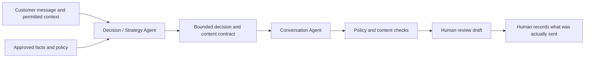

# Study-Abroad Sales Agent (V2 offline coursework prototype)

An English-language, synthetic-data prototype that helps a human adviser decide and draft the next response in a study-abroad sales conversation. V2 separates **what to do next** from **how to say it** and keeps factual and commercial commitments reviewable. The browser workspace and local bridge are a demonstration, not a customer messaging service.

## The problem

A prospect's short message can leave several plausible interpretations. A sales assistant needs to decide whether to clarify, provide evidence, discuss a permitted offer, pause, or stop. A fluent reply alone does not show that it chose the right next step.

## Architecture



- The **Decision / Strategy stage** proposes a bounded objective, next action, evidence IDs, and a content contract. It may request approved read-only tools; unavailable evidence must not become a factual claim.
- The **Conversation stage** turns that contract into natural wording without changing material facts or commitments.
- Deterministic **policy Gates** check the decision and draft. An unapproved custom offer needs a separate human approval and a new decision.
- The **event store** keeps inbound text, context, decisions, drafts, reviews, approvals, and a human-entered record of what was actually sent distinct. A draft or approval is never itself a send.

## Code in this repository

The repository contains the V2 offline architecture and coursework fixtures:

| Path | Purpose |
| --- | --- |
| `sales_agent/v2_pipeline/` | Decision and Conversation provider boundaries, orchestration, deterministic policy gates |
| `sales_agent/v2_runtime/` | Event records, revisions, human review, and actual-send recording |
| `sales_agent/v2_tools/` | Read-only evidence tool contracts and source checks |
| `sales_agent/v2_offline_api/` | Adapter for the local synthetic workspace |
| `sales_agent/v2_security/` | Opt-in, fail-closed authentication, scope, model-data and deployment configuration seams; not wired to the demo |
| `sales_agent/v2_notifications/` | Opt-in generic reminder-delivery boundary with injected store/sender; not wired to Firebase or devices |
| `web/` | Browser demo and loopback-only Python bridge |
| `knowledge/advantages.v1.json` | Invented, digest-pinned advantage cards used only to exercise the tool path |
| `evals/` | English synthetic development cases and repeatable evaluation protocol |
| `analysis/` | B0/B1/B2 cost assumptions, calculator, sensitivity, and limitations |

The product prices in `policy.py`, advantage cards, student details, Gold-style cases, and cost inputs are **invented coursework fixtures**. Do not interpret them as an agency's approved prices, verified claims, customer records, or observed business performance.

## Run locally

Requires Python 3.10+ and Node.js for the browser tests. From the repository root:

```sh
python3 scripts/run_v2_offline_trace_demo.py --output /tmp/sales-public-trace.md
python3 -m unittest web.tests.test_bridge_server -v
node --test web/tests/*.test.js
python3 web/bridge_server.py 8765
```

Open `http://127.0.0.1:8765/?bridge=offline` for the synthetic workspace. The bridge binds to loopback and does not connect to a CRM or messaging channel. The default mode uses a fixed script. A local Ollama experiment is available through the explicit `--ollama-model` option; its output remains subject to the same Gates and human-review path. See the [offline adapter guide](sales_agent/v2_offline_api/README.md) and [browser guide](web/README.md) for the exact local workflow.

**Typical demo flow:** create a clearly marked synthetic student, record an inbound message, request a decision, inspect the Gate result and draft, request a revision or approve it, then record an external send only if a human claims to have sent the exact text. The system itself never contacts a student. A local outcome entry is only an operator assertion; it does not verify payment or conversion.

## Evaluation and cost

The [evaluation guide](evals/README.md) explains the English development cases, labels, B0/B1/B2 comparison, commands, scoring, and limits. The cases are synthetic adaptations and newly invented challenges. They are **not** the private, owner-approved Gold set and not an independent holdout. Scripted tests can check schema, event lineage, policy constraints and reproducibility; adviser judgment and real customer outcomes remain unmeasured.

The security and notification packages are standalone, opt-in boundaries. They use injected identity, directory, storage, and transport interfaces and are not connected to the browser bridge. Their SDK stubs and synthetic tests do not establish deployed authentication, cloud configuration, push delivery, or real-student readiness. Run the focused checks with `python3 -m unittest tests.test_v2_security_sync tests.test_v2_security_sync_data tests.test_v2_security_sync_firebase tests.test_v2_notification_sync -v`.

The [cost analysis](analysis/COST_ANALYSIS.md) compares a zero-model rule/template baseline (B0), a one-call baseline (B1), and the V2 multi-stage path (B2). Its prices, tokens, handling times, volume, fixed costs, build effort and acceptance rates are **assumptions**, not observed spend or savings. Reproduce its arithmetic with `python3 analysis/cost_model.py` and `python3 -m unittest analysis.test_cost_model -v`.

## Current status

The local scripted pipeline, review states, Gates, synthetic event store, browser demo, and reproducible development fixtures run offline. The optional local model path is experimental. Approved live programme/case sources, production authentication, CRM or messaging integration, measured human effort, independent blinded business review, and real outcome validation are pending. No conversion improvement or production readiness is claimed.

Synthetic conversations support regression testing but do not demonstrate conversion, customer trust, or real-world sales performance.

## My work

The project defines the target workflow, the separation between strategy and wording, the evidence and policy boundaries, and review criteria. It was iterated with AI coding tools and inspected through local tests and traces. The coursework evaluation and cost appendices expose assumptions and remaining evidence gaps.

## Disclosure boundary

This code release contains synthetic fixtures only. Do not enter real student data into the demo.
