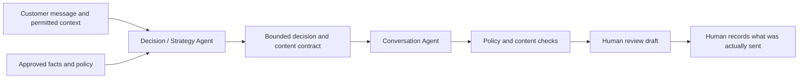

# Study-abroad Sales Agent

An offline prototype for helping a human advisor decide and draft the next response in a study-abroad sales conversation. It is designed to separate **what to do next** from **how to say it**, while keeping factual and commercial commitments reviewable.

## The problem

A prospect's short message can leave several plausible interpretations. A sales assistant needs to decide whether to clarify, provide evidence, discuss a permitted offer, pause, or stop. A fluent reply alone does not show that it chose the right next step.

## Architecture



- The **Decision / Strategy Agent** chooses a bounded objective and next action, with evidence and approval constraints.
- The **Conversation Agent** turns the approved content contract into natural wording without changing material facts or commitments.
- Deterministic checks and human review separate internal decisions, drafts, and messages actually sent.

## Code in this repository

This is a curated snapshot of the offline V2 architecture, with a fresh Git history. It includes:

| Path | Purpose |
| --- | --- |
| `sales_agent/v2_pipeline/` | Decision and Conversation provider boundaries, orchestration, deterministic policy gates |
| `sales_agent/v2_runtime/` | Event records, revisions, human review, and actual-send recording |
| `sales_agent/v2_tools/` | Read-only evidence tool contracts and source checks |
| `sales_agent/v2_offline_api/` | Adapter for the local synthetic workspace |
| `web/` | Browser demo and loopback-only Python bridge |
| `knowledge/advantages.v1.json` | Invented, digest-pinned advantage cards used only to exercise the tool path |

The product prices in `policy.py` and the advantage cards are **invented portfolio fixtures**. The private repository's actual price policy, approved business claims, internal Gold cases, evaluation transcripts, course files, and Git history are not present here.

## Run locally

Requires Python 3.10+ and Node.js for the browser tests. From the repository root:

```sh
python3 scripts/run_v2_offline_trace_demo.py --output /tmp/sales-public-trace.md
python3 -m unittest web.tests.test_bridge_server -v
node --test web/tests/*.test.js
python3 web/bridge_server.py 8765
```

Open `http://127.0.0.1:8765/?bridge=offline` for the synthetic workspace. The bridge binds to loopback and does not connect to a CRM or messaging channel. The default mode uses a fixed script. A local Ollama experiment is available through the explicit `--ollama-model` option; its output remains subject to the same gates and human-review path.

Local tests and scripted scenarios exercise the components. Live external data sources and a fully accepted model-driven end-to-end sales flow have not been established. The system does not automatically contact students.

Synthetic conversations are useful for regression testing but do not demonstrate conversion, customer trust, or real-world sales performance.

## My work

I defined the target workflow, the separation between strategy and wording, the evidence and policy boundaries, and the review criteria. I iterated on the prototype with AI coding tools and inspected its behavior through local tests and traces.

## Disclosure boundary

This code release excludes customer records, private source databases, exact price and negotiation rules, internal evaluation transcripts, and credentials. Do not enter real student data into the demo.
